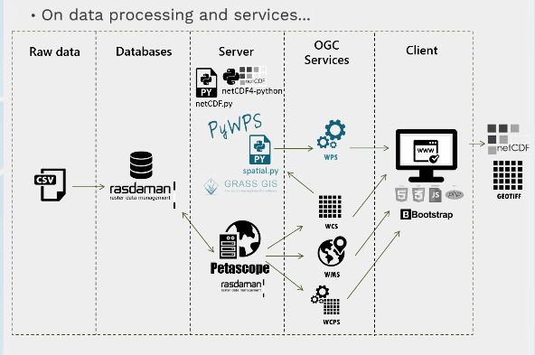

# Spatial

## Programs

* [Univ Wisc VisAd - Java](http://visad.ssec.wisc.edu/)
    - Visual aid for algorithm development
* [MeteoThinker ](http://www.meteothinker.com/)
    - [Github link](https://github.com/meteoinfo)
    - 
* [List of Open Source Programs and Platforms](https://www.gislounge.com/open-source-gis-applications/)

## Shapefiles

## Rasters

* [Raster management with rasdaman - netcdf](http://landcover.como.polimi.it//BigNetCDF/)
* [Petascope user guide - rasdaman](http://www.rasdaman.org/wiki/PetascopeUserGuide)
* [Big data processing presentation with  mongo and rasdaman](https://prezi.com/blbw60i9k0d2/sensing-the-city-from-big-data/)
    

## Databases

### PostgreSQL

### SQLite

* [R-tree indexing within sqlite](https://www.sqlite.org/rtree.html)

